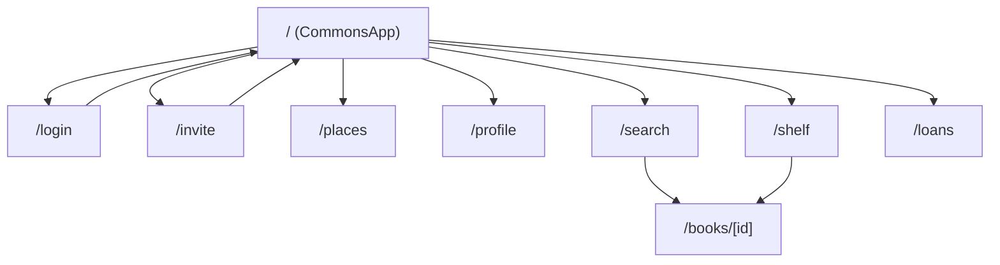

# アプリ構成整理（現状）

最終更新: 2026-02-13

## 1. 画面ルーティング（App Router）

| パス | 役割 | UI実体 |
|---|---|---|
| `/` | ホーム | `CommonsApp`（モバイル/デスクトップ統合UI） |
| `/search` | 検索 | `CommonsAppInner initialTab="search"` |
| `/shelf` | 本棚 | `CommonsAppInner initialTab="shelf"` |
| `/loans` | 貸出管理 | `CommonsAppInner initialTab="loans"` |
| `/profile` | プロフィール | `CommonsAppInner initialTab="profile"` |
| `/books/[id]` | 本詳細 + 感想投稿/閲覧 | サーバー描画ページ |
| `/places` | 場所管理 | クライアントページ（フォーム + 一覧） |
| `/messages` | メッセージ | 現状はプレースホルダ |
| `/login` | ログイン | 認証ページ |
| `/invite` | 新規登録 | 招待コード入力付き登録ページ（任意入力） |

## 2. 画面間の主な導線

補足:
- `CommonsApp` 内のタブ遷移は基本的にコンポーネント内部状態で管理。
- `/search`, `/shelf`, `/loans`, `/profile` は「直リンク時に同じベースUIを開くための入口」として用意。

## 3. APIルート一覧（現状）

### 認証
- `POST /api/auth/signup`
- `POST /api/auth/login`
- `POST /api/auth/logout`

### ユーザー
- `GET /api/users/me`
- `GET /api/users/:id`
- `GET /api/users`
- `GET /api/users/:id/books`

### 書籍・本棚・感想
- `GET /api/books/search`
- `GET /api/books/:id`
- `GET/POST /api/books/:id/reviews`
- `GET /api/reviews/feed`
- `PATCH /api/reviews/:id`
- `GET/POST /api/user-books`
- `PATCH/DELETE /api/user-books/:id`

### 貸出
- `GET /api/loans/mine`
- `GET/POST /api/loans`

### その他
- `GET /api/messages/:userId`
- `GET /api/notifications`
- `POST /api/invitations`
- `GET/POST /api/places`
- `GET /api/health/db`

## 4. データ構成（高レベル）

中心テーブル:
- `users`
- `books`
- `user_books`
- `loans`
- `reviews`
- `messages`
- `notifications`
- `invitations`

拡張（場所）:
- `places`
- `place_members`

メモ:
- `db/migrations/0004_relationships_places.sql` は relationship 系テーブル定義を含むが、現行UI/APIでは relationship 機能を利用していない。

## 5. 現状の注意点

- `/messages` はプレースホルダのため、実運用向け導線は未完成。
- タブ中心UI（`CommonsApp`）と、個別ページUI（`/books/[id]`, `/places`）が混在。
- 検索は内部データ + Google Books 連携を `GET /api/books/search` で統合。
